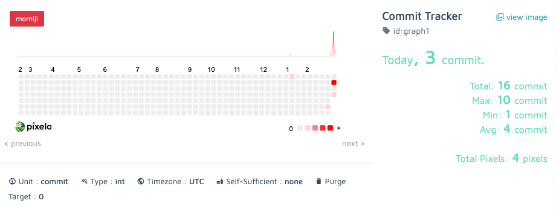

# Git Commit Tracker

A simple habit tracker using Pixela API. The program generates a username, graph, and pixels using
that the user has on his own page. The ability to get, post, update and delete the pixel was implemented.
The next step is to create a fully functional GUI and provide the user the ability to input the date visually.


## Features

- Create a new user account
- implemented the GET, POST, PUT, DELETE

## Future Features
- Fully functional GUI
- Ability to change color of the graph1
- Ability tp POST, PUT, DELETE directly from the GUI
- User input from past date
- GitHub API integration.

## Authors

- [@sanduler](https://github.com/sanduler)

### Built With

- [Python3](https://www.python.org/)

<p align="right">(<a href="#top">back to top</a>)</p>

<!-- GETTING STARTED -->

## Getting Started

This is an example of how you may give instructions on setting up your project locally.
To get a local copy up and running follow these simple example steps.

### Prerequisites

This is an example of how to list things you need to use the software and how to install them.

- npm
  ```sh
  npm install npm@latest -g
  ```

### Installation

1. Clone the repo
   ```sh
   git clone https://github.com/sanduler/git-habit-tracker
   ```
2. Install NPM packages
   ```sh
   npm install requests
   ```

<p align="right">(<a href="#top">back to top</a>)</p>


## Screenshots


--------------------------------

## License

[MIT](https://choosealicense.com/licenses/mit/)

